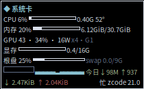
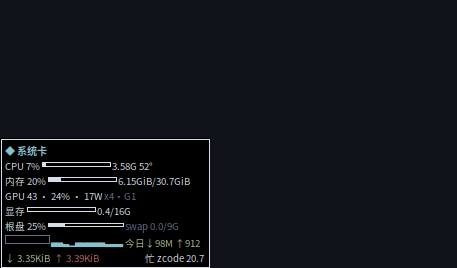

# conky-ai-cards

[](LICENSE)
[](#)
[](#)
[](#)
[](#)
[](README.en.md)

**Conky 悬浮卡：系统监控 + AI token 用量，两张轻量桌面卡。**
*Lightweight Conky cards for system monitoring & AI token usage on your desktop.*（[English README](README.en.md)）




四主题静态对比见 [screenshots/themes.png](screenshots/themes.png)。

两张置顶悬浮卡（合计约 46MB 内存，Electron 方案的 7%）：一张管机器（CPU/内存/GPU/显存/盘/网速），一张管 AI 用量（今日 token、5 小时窗口、首字延迟、近 7 日趋势）。全部功能通过一个 zenity 菜单控制：缩放、透明度、位置记忆、点击穿透。

| 卡 | 内容 |
|---|---|
| 系统卡 | CPU 占用·频率·温度、内存+swap、GPU 温度·占用·功耗·**PCIe 链路·计算进程**、显存、根盘、CPU 60s 走势图、今日上下行流量、实时网速、最忙进程 |
| 今日 token 卡 | 今日总量、**5h 滚动窗口**、输入/输出拆分、**首字延迟中位数**、请求数与主力模型、对 7 日峰值进度条、**近 7 日迷你柱状图** |

数值超阈值变红（Nord 配色），温度/内存/磁盘/token 达峰还会弹系统通知（带冷却，不轰炸）。

## 特性

- **轻**：两个 conky 进程 + 每 4s/15s 起一个 python，合计 ~46MB，无 Electron 无浏览器内核
- **无级缩放**：滑块选 0.70×–2.00× 任意大小（conky 只在启动时读配置，卡片"闪一下"按新尺寸重生——这是架构上限）；缩放后自动重排，防出屏/防两卡重叠
- **四套主题**：Nord / Gruvbox / Dracula / Catppuccin 一键切，`themes/` 丢个 `.conf` 即可加自己的
- **两级告警**：黄预警 + 红告警渐变（温度/内存/显存/根盘/token 峰值各有阈值），达峰还弹系统通知（带冷却不轰炸）
- **点击穿透**：conky 没有这个功能——本项目用 XShape 扩展外挂实现（把窗口 input region 置空），零常驻进程；开启后鼠标划过卡片直达下层，Super+拖动仍可移卡
- **优雅降级**：无 N 卡自动隐藏 GPU/显存行；无 ZCode 用量库显示提示而不崩；网卡名动态探测
- **自检**：`conky-doctor` 逐项探测依赖，报告你机器上哪些功能能亮

## 安装

依赖：`conky-all`、`python3`、`zenity`、`x11-utils`（xwininfo）、`libnotify-bin`（notify-send）、中文字体 `fonts-noto-cjk` + `fonts-wqy-microhei`（方块字符）、可选 `python-xlib`（点击穿透）、`nvidia-smi`（N 卡）。

```bash
sudo apt install conky-all zenity x11-utils libnotify-bin fonts-noto-cjk fonts-wqy-microhei
pip install python-xlib        # 点击穿透需要

git clone https://github.com/<you>/conky-ai-cards.git
cd conky-ai-cards
./install.sh                   # 幂等，可重复执行
```

安装内容：配置 → `~/.config/conky-ai-cards/`，命令 → `~/.local/bin/`，应用菜单“悬浮卡”+ 开机自启（安装完自动跑一次 `conky-doctor` 自检）。卸载：`./uninstall.sh`。

**自启方式二选一**：默认 `.desktop`；也可用 systemd 用户服务（日志进 journal、unit 化管理，见 `autostart/conky-ai-cards.service` 文件头注释的启用步骤）。

## 使用

一切操作走应用菜单 **“悬浮卡控制”**（或终端 `conky-ctl`）：

| 操作 | 说明 |
|---|---|
| 开关 | 全部开启 ⇄ 全部关闭（`conky-card token/system` 可只留一张） |
| 放大 / 缩小 / 复位 | 0.70×–2.00× 步进缩放 |
| 缩放(无级) | 滑块任意选 0.70–2.00 |
| 记住位置 | Super+拖动挪好位置后点它，重启/开机不再漂移 |
| 透明度 | 255/230/195/153/102 五档 + **glass**（背景全透、文字实色） |
| 主题 | Nord / Gruvbox / Dracula / Catppuccin |
| 点击穿透 | 鼠标划过卡片直达下层窗口（状态文件 `clickthrough.txt`，重启自动恢复） |

改卡片上显示什么：编辑 `~/.config/conky-ai-cards/sys-body.py`（系统卡）和 `zcode-today.py`（token 卡）——正文全部由 python 生成，lua 只管窗口。

## 数据源

- 系统卡：`/proc`、`nvidia-smi`、`ps`，纯本机
- token 卡：ZCode CLI 的本机用量库 `~/.zcode/cli/db/db.sqlite`（只读，`PRAGMA query_only=ON`；SQL 全为字面量 + `?` 绑定）。注意**官方剩余额度在服务端**，本机库只有 token 数，卡上的“5h 窗口”是本地参考值
- 今日流量：`/proc/net/dev` 累计值 − 零点基线（`net-base.json` 自动维护）

## 架构与坑（最有价值的部分）

**lua 只管窗口，正文全部 python 生成。** lua 里只有一行 `${execpi 4 python3 sys-body.py}`，输出被 conky 当作 conky 文本二次解析——python 判阈值后直接输出 `${color}`、`${cpubar}` 等对象。

为什么这么绕？因为 **conky 1.19.6 的 `if_match` 分支内 `${color}` 在 X 渲染下时灵时不灵**：同一张卡 CPU 行变红、内存行不变；同一行这次红下次白；`conky -t` 控制台模式下却全部正常。T/F 标记实验证明分支选择正确，纯粹是颜色对象渲染失效。绕不开就换路：python 侧判断，输出颜色对象，彻底绕开 if_match。

其他实测过的坑（改配置前建议一读）：

- `execi`/`execpi` 参数里**不能出现 `$` 和 `{`**（conky 解析器吃掉）；需要变量时用 python 文件
- `execibar` 不写尺寸参数会占满整行，把同行数值挤飞；**`execigraph` 的尺寸参数解析在 1.19.6 是坏的**（实验实证：无论尺寸放哪都被塞进颜色槽，且命令只吃单个单词）——GPU 走势因此用字符趋势而非 graph
- `own_window_argb_value` 管**整个窗口（含文字）**的透明度；`own_window_transparent` 只把**背景**归零——“透明背景 + 实色文字”必须两者配合
- conky 的 `gap_y` 与窗口实际 y 有 ~5px 字体留白差，位置记忆要做两段校准才收敛
- Unicode 方块字符（▁▃█，U+2581–88）Noto Sans CJK **没有字形**，须用文泉驿等；且 XFT 渲染有字距，方块连不成完美阶梯
- XShape 的穿透设置随窗口销毁失效——一切重启卡的动作都要重新施加（`start-all.sh` 末尾已挂自动恢复）
- 无边框窗口在 GNOME 下 `own_window_type = normal` + hints `below` 会“隐形”（被壁纸窗口盖住），别用

## 已知限制

- 首字延迟/5h 窗口等 token 功能依赖 ZCode CLI 的库结构（`model_usage`/`turn_usage` 表），其他 AI CLI 用户需自行适配 SQL
- 点击穿透需要 X11 会话（Wayland 下 XShape 对原生窗口无效）
- 7 日柱状图的方块字符间有字距缝隙（XFT 渲染特性），数据正确但视觉非完美阶梯

## License

MIT
